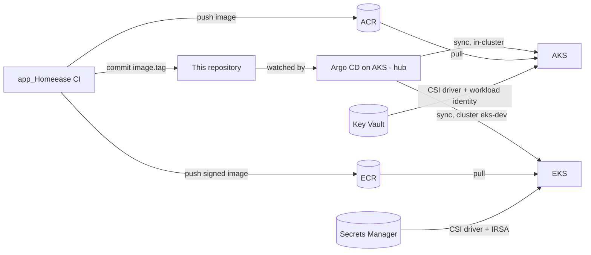

# HomeEase — GitOps

This repository is the **desired state of everything that runs on the HomeEase Kubernetes clusters**: AKS on Azure and EKS on AWS. One **Argo CD**, running on AKS, watches it and makes both clusters match it. A deployment is a commit, and a rollback is a revert.

It contains one Helm chart per service, the Argo CD applications for each environment, the monitoring stack (Prometheus, Grafana, Alertmanager, Loki, Alloy, a DORA exporter) and the one-time cluster bootstrap scripts.

## Live links

| Environment | Customer site | Admin console |
|---|---|---|
| Azure — AKS | https://homeease-app.centralindia.cloudapp.azure.com | https://homeease-admin.centralindia.cloudapp.azure.com |
| AWS — EKS | https://d1c07dtmd5gx45.cloudfront.net | https://d3220hgmchhivu.cloudfront.net |
| AWS — ECS Fargate (legacy, not managed by this repo) | https://d1dtc9ngh4fly7.cloudfront.net | https://d3vprnd9vqtd6q.cloudfront.net |

Argo CD, Grafana and Alertmanager are not exposed publicly. Open them with a port-forward:

```bash
# Argo CD (on AKS; shows the apps of both clusters)
kubectl --context aks-homeease-dev -n argocd port-forward svc/argocd-server 8443:443          # https://localhost:8443
kubectl --context aks-homeease-dev -n argocd get secret argocd-initial-admin-secret -o jsonpath='{.data.password}' | base64 -d
# Grafana and Alertmanager (run against either cluster)
kubectl -n monitoring port-forward svc/kube-prometheus-stack-grafana 3000:80                   # http://localhost:3000
kubectl -n monitoring port-forward svc/kube-prometheus-stack-alertmanager 9093:9093            # http://localhost:9093
```

## Related repositories

- [app_Homeease](https://github.com/SrinidhiSanjeevi/app_Homeease) — the six services and their CI; CI commits new image tags into this repo.
- [Infrastruture_Homeease](https://github.com/SrinidhiSanjeevi/Infrastruture_Homeease) — Terraform that creates the AKS and EKS clusters, registries and secret stores.

## How a deployment flows



1. CI builds an image tagged with the 12-character commit SHA and pushes it to ACR (Azure DevOps) or ECR (GitHub Actions).
2. CI commits the new tag into `charts/<service>/values-azure-dev.yaml` or `values-aws-dev.yaml`. Nothing else changes.
3. Argo CD sees the commit, renders the chart and rolls the Deployment. Automated sync with **self-heal** and **prune** means a manual change in a cluster is reverted, and a resource removed from Git is removed from the cluster.
4. A rollback is `git revert` of the promotion commit.

## Concepts implemented

**GitOps with a single Argo CD for two clouds (hub model).**
- Argo CD runs only on AKS.
- The EKS cluster is registered in it as `eks-dev`, so one UI shows and controls both clouds.
- EKS runs no Argo CD of its own, and CI never holds cluster credentials.

**App of apps.**
- Each environment folder has a `root-app.yaml`, applied once by hand.
- The root app creates the AppProject and one Application per service from the same folder.
- Sync waves create the project and the monitoring stack (wave `-1`) before the services.

**AppProjects as guard rails.**
- Each project allows only this repository and the Prometheus/Grafana Helm repositories as sources.
- It allows only the listed cluster and namespace as destinations.
- It allows only the resource kinds the charts use.

**One chart, many environments.**
- The same templates render for every environment; only the values file changes.
- Shared defaults live in `values.yaml`; each environment overrides them in `values-<cloud>-<env>.yaml`.
- Differences between Azure and AWS are values, never template forks.

**Promotion across environments.**
- `values-azure-dev.yaml` is updated on every merge.
- `values-azure-staging.yaml` and `values-azure-prod.yaml` are updated by approval-gated pipeline stages.
- `argocd/azure-staging` runs staging in its own namespace on AKS.
- `argocd/azure-prod` is prepared for a separate prod cluster with its own Argo CD.

**What every service chart provides.**
- **Pod security:**
  - Runs as non-root (UID 1001), with no privilege escalation.
  - Read-only root filesystem, all Linux capabilities dropped, and the `RuntimeDefault` seccomp profile.
- **Network isolation:** a NetworkPolicy per service admits only its real callers. For example, payment-service accepts traffic only from the backend, plus Prometheus scrapes from the `monitoring` namespace.
- **Availability:**
  - Readiness, liveness and startup probes on `/health/*`.
  - A PodDisruptionBudget, and topology spread across nodes.
  - A HorizontalPodAutoscaler on CPU: 1–3 pods on AKS, at least 2 for the critical services on EKS.
- **Secrets without secrets in Git:**
  - A SecretProviderClass mounts values from Azure Key Vault (workload identity) or AWS Secrets Manager (IRSA) through the Secrets Store CSI driver.
  - The values are synced into a Kubernetes Secret that the pod reads as environment variables.
- **Ingress:**
  - On AKS, two ingress-nginx controllers with separate public IPs (customer and admin), plus Let's Encrypt certificates from cert-manager.
  - On EKS, two ingress-nginx controllers behind two NLBs, with CloudFront in front for HTTPS.
  - Only the frontends are exposed on EKS.
- **Metrics:** a ServiceMonitor so Prometheus scrapes each service's `/metrics`.

**Monitoring stack** (the `monitoring` / `monitoring-aws` applications).
- **Metrics:** Prometheus keeps 15 days of metrics.
- **Logs:** Alloy ships every container's logs to Loki, which keeps them for 30 days.
- **Grafana dashboards** are provisioned from code (`platform/kube-prometheus-stack/dashboards`): business overview, payment service, RED metrics (rate, errors, duration) with Kubernetes health, logs, alerts, and DORA.
- **15 alert rules**, for example:
  - service unavailable, crash looping, pods pending too long;
  - high 5xx rate, high latency;
  - payment failure rate, notification delivery failing, bookings waiting for a professional;
  - the log pipeline dropping entries, cluster CPU near capacity, the main pipeline failing.
- **Email alerting with escalation:**
  - Critical alerts mail the DevOps engineer at once.
  - If still firing after 15 minutes, they also go to the lead, and after 30 minutes to the manager.
  - Warnings are suppressed while a related critical alert fires.
- **DORA metrics:** a small Python exporter reads the Azure DevOps and GitHub Actions history and publishes deployment frequency, lead time, change failure rate and time to restore.

## Argo CD applications

| Folder | Applications | Projects | Destination |
|---|---|---|---|
| `argocd/azure` | `<service>-dev`, `monitoring` | `homeease`, `platform` | AKS (in-cluster), namespace `homeease-dev` |
| `argocd/aws` | `<service>-aws-dev`, `monitoring-aws` | `homeease-aws`, `platform-aws` | cluster `eks-dev`, namespace `homeease-dev` |
| `argocd/azure-staging` | `<service>-staging` | `homeease-staging` | AKS (in-cluster), namespace `homeease-staging` |


## Everyday operations

| Task | How |
|---|---|
| Deploy | Automatic: CI commits the new `image.tag`, Argo CD syncs |
| Roll back | `git revert` the promotion commit |
| Change a setting (rate limit, replicas, URL) | Edit the environment's values file and merge |
| Check the Azure flow end to end | `scripts/verify-azure-flow.sh` (read-only) |
| Bootstrap a new cluster (once) | `scripts/bootstrap-cluster.sh` (AKS), `scripts/bootstrap-eks.sh` (EKS) |
| Check a chart before merging | `helm lint charts/backend -f charts/backend/values-aws-dev.yaml` and `helm template ...` |
