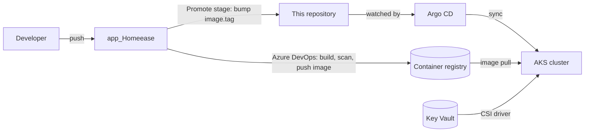

# HomeEase — GitOps

The desired state of everything that runs on the HomeEase Kubernetes cluster (AKS). **Argo CD** watches this repository and makes the cluster match it, so a deployment is a commit, and a rollback is a revert.

Related repositories: `app_Homeease` builds the images and `Infrastructure_Homeease` creates the cluster itself.

## How it fits together

1. CI builds an image tagged with the commit SHA and pushes it to the registry.
2. The pipeline's Promote stage commits the new tag into `charts/<service>/values-azure-dev.yaml`.
3. Argo CD notices the commit, renders the Helm chart and rolls the Deployment. Automated sync with self-heal and pruning means manual changes in the cluster are reverted.

## What each chart provides

- **Security** — non-root, read-only filesystem and dropped capabilities where the image allows; a NetworkPolicy per service that admits only its real callers.
- **Availability** — readiness, liveness and startup probes; a PodDisruptionBudget; an HPA scaling between 1 and 3 pods on CPU.
- **Secrets** — read from Azure Key Vault at pod start through the CSI driver and workload identity. No secret value is stored in Git.
- **Observability** — a ServiceMonitor so Prometheus scrapes each service's `/metrics`.
- **Rate limits and URLs** — set per environment in the values file, for example the `env.rateLimits` map on the backend chart.

## Everyday operations

- **Deploy:** automatic. CI commits the new `image.tag` and Argo CD syncs.
- **Roll back:** `git revert` the promotion commit.
- **Check everything:** `scripts/verify-azure-flow.sh` (read-only).

## Monitoring

Prometheus and Grafana (`kube-prometheus-stack`), Loki for logs and Alloy shipping container logs run as the `monitoring` application. Dashboards are provisioned from `platform/kube-prometheus-stack/dashboards`: business overview, payment service, RED metrics, logs, alerts and DORA. Details are in `platform/README.md`.

## AWS (EKS)

The same charts also deploy to an EKS cluster. Argo CD there watches `argocd/aws/bootstrap`, which points at `charts/<service>/values-aws-dev.yaml`. Differences from Azure are values, not templates:

- **Secrets** come from AWS Secrets Manager through the Secrets Store CSI driver (`secretProviderClass.provider: aws`) and an IAM role per service group (IRSA), instead of Key Vault and workload identity.
- **Ingress** is two ingress-nginx controllers behind two NLBs, fronted by CloudFront for HTTPS (`platform/aws/`). Only the frontends are exposed.
- **Bootstrap:** `scripts/bootstrap-eks.sh` (once). The Azure charts' rendered output is unchanged by the AWS options.
