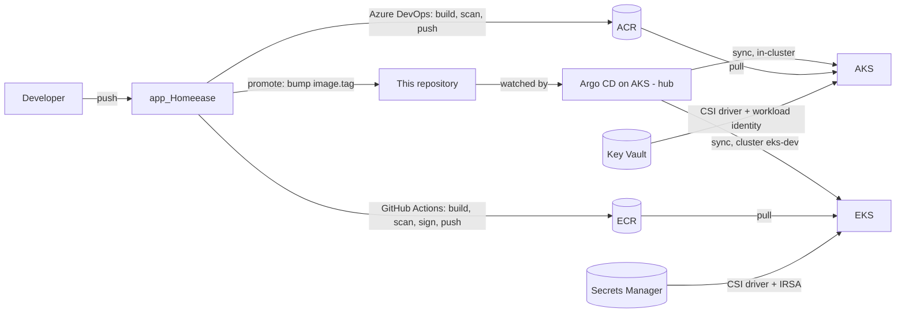

# HomeEase — GitOps

The desired state of everything that runs on the HomeEase Kubernetes clusters: **AKS** on Azure and **EKS** on AWS. One **Argo CD**, running on AKS, watches this repository and makes both clusters match it. A deployment is a commit, and a rollback is a revert.

Related repositories: [`app_Homeease`](https://github.com/SrinidhiSanjeevi/app_Homeease) builds the images and [`Infrastruture_Homeease`](https://github.com/SrinidhiSanjeevi/Infrastruture_Homeease) creates the clusters.

## How it fits together



1. CI builds an image tagged with the 12-character commit SHA and pushes it to ACR (Azure DevOps) or ECR (GitHub Actions).
2. The pipeline's Promote stage commits the new tag into `charts/<service>/values-azure-dev.yaml` or `values-aws-dev.yaml`.
3. Argo CD notices the commit, renders the Helm chart and rolls the Deployment. Automated sync with self-heal and pruning means manual changes in a cluster are reverted.

## Repository layout

```
charts/<service>/          one Helm chart per service (6), with a values file per environment
  values.yaml              defaults shared by every environment
  values-azure-dev.yaml    AKS dev (written by the Azure DevOps promote stage)
  values-aws-dev.yaml      EKS dev (written by the GitHub Actions promote job)
  values-azure-staging.yaml, values-azure-prod.yaml   approval-gated promotion targets
argocd/azure/              AKS dev: root app, one Application per service, monitoring, AppProjects
argocd/aws/                EKS dev: same set, run by the AKS Argo CD against cluster eks-dev
argocd/azure-staging/      staging namespace on AKS (homeease-staging)
argocd/azure-prod/         prod; meant for a separate prod cluster with its own Argo CD
platform/                  monitoring stack and cluster add-ons (see platform/README.md)
scripts/                   one-time cluster bootstrap and a read-only verification script
```

Every Argo CD folder follows the app-of-apps pattern: `bootstrap/root-app.yaml` is applied once by hand, and it creates the AppProject and the other Applications in the same folder.

## What each chart provides

- **Security** — non-root, read-only filesystem and dropped capabilities where the image allows; a NetworkPolicy per service that admits only its real callers.
- **Availability** — readiness, liveness and startup probes; a PodDisruptionBudget; an HPA scaling between 1 and 3 pods on CPU.
- **Secrets** — read at pod start through the Secrets Store CSI driver: from Azure Key Vault with workload identity on AKS, from AWS Secrets Manager with IRSA on EKS (`secretProviderClass.provider`). No secret value is stored in Git.
- **Observability** — a ServiceMonitor so Prometheus scrapes each service's `/metrics`.
- **Rate limits and URLs** — set per environment in the values file, for example the `env.rateLimits` map on the backend chart.

Differences between the clouds are values, not templates: the same chart renders for both.

## Argo CD applications

| Folder | Applications | Project | Destination |
|---|---|---|---|
| `argocd/azure` | `<service>-dev`, `monitoring` | `homeease`, `platform` | in-cluster AKS, namespace `homeease-dev` |
| `argocd/aws` | `<service>-aws-dev`, `monitoring-aws` | `homeease-aws`, `platform-aws` | cluster `eks-dev`, namespace `homeease-dev` |
| `argocd/azure-staging` | `<service>-staging` | `homeease-staging` | in-cluster AKS, namespace `homeease-staging` |

The AppProjects allow only this repository and the Prometheus and Grafana Helm repositories as sources, and only the listed destinations.

## Bootstrap (once per cluster)

- **AKS:** `scripts/bootstrap-cluster.sh` installs Argo CD, ingress-nginx (customer and admin), cert-manager and the monitoring secrets, then applies `argocd/azure/bootstrap/root-app.yaml`.
- **EKS:** `scripts/bootstrap-eks.sh` installs the gp3 default StorageClass, the Secrets Store CSI driver with the AWS provider, the two ingress-nginx controllers and the monitoring secrets. With `REGISTER_WITH_HUB=1` it also registers the cluster in the AKS Argo CD as `eks-dev` and applies `argocd/aws/bootstrap/root-app.yaml` there. EKS runs no Argo CD of its own.

On EKS only the two frontends are exposed, each through its own NLB, with CloudFront in front for HTTPS (`platform/aws/`).

## Everyday operations

- **Deploy:** automatic. CI commits the new `image.tag` and Argo CD syncs.
- **Roll back:** `git revert` the promotion commit.
- **Check the Azure flow:** `scripts/verify-azure-flow.sh` (read-only).

## Monitoring

Prometheus and Grafana (`kube-prometheus-stack`), Loki for logs and Alloy shipping container logs run as the `monitoring` / `monitoring-aws` applications. Dashboards are provisioned from `platform/kube-prometheus-stack/dashboards`: business overview, payment service, RED metrics, logs, alerts and DORA. Alertmanager sends alerts by email. Details are in `platform/README.md`.

## Checking changes locally

```bash
for c in charts/*/; do for f in "$c"values-*.yaml; do helm lint "$c" -f "$f" --quiet; done; done
helm template charts/backend -f charts/backend/values-aws-dev.yaml
```
