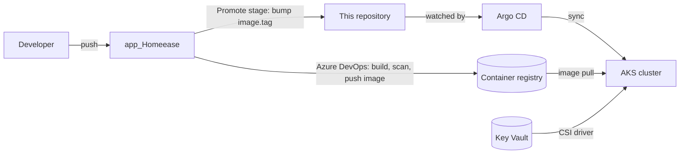

# HomeEase — GitOps

The desired state of everything that runs on the HomeEase Kubernetes cluster (AKS). **Argo CD** watches this repository and makes the cluster match it, so a deployment is a commit, and a rollback is a revert.

Related repositories: `app_Homeease` builds the images and `Infrastructure_Homeease` creates the cluster itself.

## How it fits together



1. CI builds an image tagged with the commit SHA and pushes it to the registry.
2. The pipeline's Promote stage commits the new tag into `charts/<service>/values-azure-dev.yaml`.
3. Argo CD notices the commit, renders the Helm chart and rolls the Deployment. Automated sync with self-heal and pruning means manual changes in the cluster are reverted.

## Layout

```
charts/<service>/       One Helm chart per service: backend, admin-backend, payment-service,
                        notification-service, frontend, admin-frontend
  values.yaml           Defaults
  values-azure-dev.yaml, values-azure-staging.yaml, values-azure-prod.yaml, values-demo.yaml
  templates/            Deployment, Service, Ingress, HPA, PodDisruptionBudget,
                        NetworkPolicy, ServiceAccount, SecretProviderClass, ServiceMonitor
argocd/
  azure/                Dev cluster: AppProject definitions and one Application per service
  azure-staging/        Staging definitions (not deployed)
  azure-prod/           Production definitions (not deployed)
  _aws-disabled/        Earlier EKS attempt, kept for reference; AWS now runs on ECS
platform/               Monitoring stack: Prometheus, Grafana, Loki, Alloy, DORA exporter
scripts/                Cluster bootstrap and verification helpers
.github/                Documentation and placeholder checks
```

The Argo CD **root application** (`argocd/azure/bootstrap/root-app.yaml`) points at the folder `argocd/azure/bootstrap`, which holds one Application per service plus `monitoring`. Adding a file there adds an application.

## What each chart provides

- **Security** — non-root, read-only filesystem and dropped capabilities where the image allows; a NetworkPolicy per service that admits only its real callers.
- **Availability** — readiness, liveness and startup probes; a PodDisruptionBudget; an HPA scaling between 1 and 3 pods on CPU.
- **Secrets** — read from Azure Key Vault at pod start through the CSI driver and workload identity. No secret value is stored in Git.
- **Observability** — a ServiceMonitor so Prometheus scrapes each service's `/metrics`.
- **Rate limits and URLs** — set per environment in the values file, for example the `env.rateLimits` map on the backend chart.

## First-time setup

The cluster itself comes from `Infrastructure_Homeease`. Then, once:

```bash
GRAFANA_ADMIN_PASSWORD='<strong password>' scripts/bootstrap-cluster.sh
```

It installs Argo CD and ingress-nginx, creates the two secrets that must stay out of Git (Grafana admin and the alert webhook), and applies the root application. Argo CD then deploys everything else. It prints the ingress IP; hostnames in the values files embed that IP (`<ip-with-dashes>.nip.io`), so update them if it changes.

## Everyday operations

| Task | How |
|---|---|
| Deploy a release | Automatic: CI commits the new `image.tag`, Argo CD syncs |
| Roll back | `git revert` the promotion commit |
| Check everything | `scripts/verify-azure-flow.sh` — pipelines, registry, Argo, pods, ingress, metrics (read-only) |
| Bookings waiting for a professional | `scripts/check-waiting-bookings.sh` (read-only) |
| Stop for the night | `az aks stop`; start with `az aks start`. The ingress IP is kept, so hostnames stay valid |
| See app status | `kubectl get applications -n argocd` |

## Monitoring

Prometheus and Grafana (`kube-prometheus-stack`), Loki for logs and Alloy shipping container logs run as the `monitoring` application. Dashboards are provisioned from `platform/kube-prometheus-stack/dashboards`: business overview, payment service, RED metrics, logs, alerts and DORA. Details are in `platform/README.md`.

## Known limits

- Single replica per service in dev, on a two-node cluster.
- Ingress hosts use `nip.io`, which some networks block; the customer site is also reachable by IP. The ingress annotations name a cert-manager issuer, but cert-manager is not installed in dev, so traffic is HTTP.
- Staging and production definitions exist but are not deployed.
